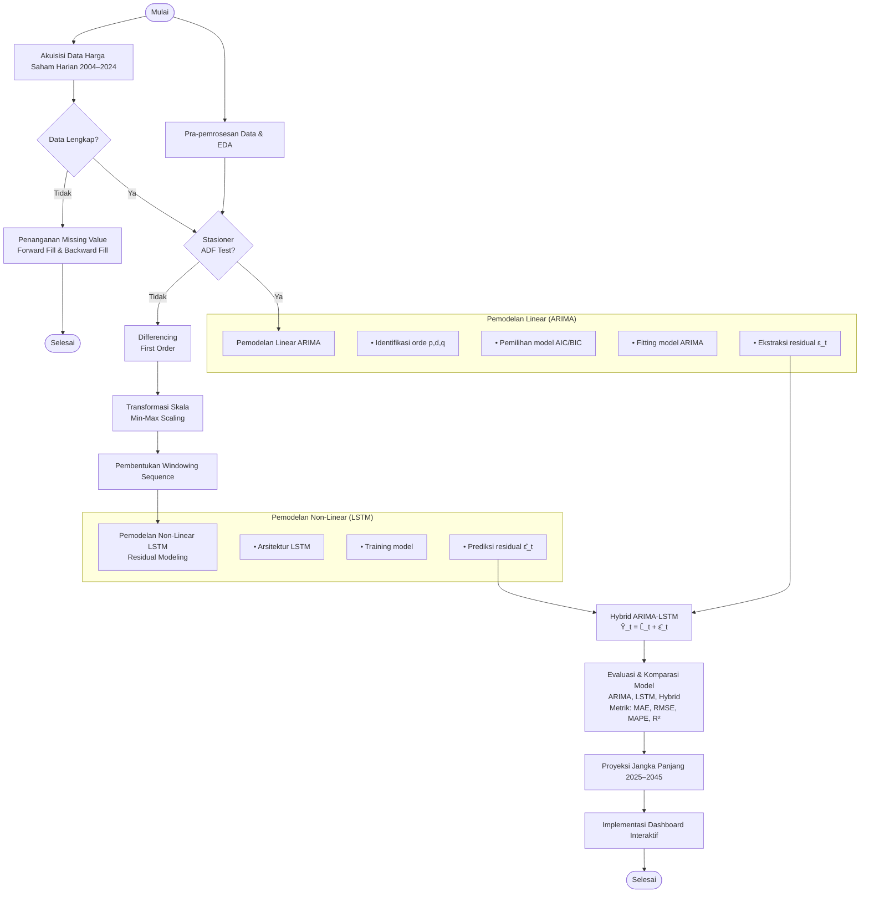

# BAB 2 METODE PENELITIAN

---

## 2.1 Kerangka Kerja Penelitian

Penelitian ini menerapkan pendekatan prediktif hibrida (*hybrid predictive modeling*) yang mengintegrasikan metode statistik klasik *Autoregressive Integrated Moving Average* (ARIMA) dengan metode *machine learning* berbasis *Artificial Neural Network* (ANN), yaitu *Long Short-Term Memory* (LSTM). Tujuan utamanya adalah melakukan proyeksi tren harga saham sektor energi batubara di Bursa Efek Indonesia (BEI/IDX) untuk rentang tahun 2025 hingga 2045 sebagai indikator proksi pertumbuhan ekonomi nasional.

Kerangka kerja penelitian secara menyeluruh disajikan pada diagram alir (*flowchart*) berikut:

---

## 2.2 Dataset Penelitian

Dataset yang digunakan dalam penelitian ini berupa data harga saham harian penutupan (*Adjusted Closing Price*) dari 4 emiten sektor energi batubara terkemuka di Bursa Efek Indonesia (BEI) yang terdaftar dalam indeks komoditas utama:

| Ticker Saham | Nama Perusahaan | Rentang Data | Jumlah Sampel | Frekuensi | Sumber Data |
| :--- | :--- | :--- | :--- | :--- | :--- |
| **ADRO** | PT Adaro Energy Indonesia Tbk | 2004 – 2024 | 5.199 | Harian (*Daily*) | Yahoo Finance API (`yfinance`) |
| **PTBA** | PT Bukit Asam Tbk | 2004 – 2024 | 5.199 | Harian (*Daily*) | Yahoo Finance API (`yfinance`) |
| **INDY** | PT Indika Energy Tbk | 2004 – 2024 | 5.199 | Harian (*Daily*) | Yahoo Finance API (`yfinance`) |
| **ITMG** | PT Indo Tambangraya Megah Tbk | 2004 – 2024 | 5.199 | Harian (*Daily*) | Yahoo Finance API (`yfinance`) |

### Karakteristik Data
Data time-series historis 21 tahun (2004–2024) ini mencakup siklus dinamika ekonomi global yang krusial, termasuk krisis finansial 2008, siklus *supercycle* komoditas energi, dan pemulihan ekonomi pasca-pandemi. Atribut utama yang digunakan untuk pemodelan adalah **`Adj Close`**.

---

## 2.3 Pra-pemrosesan Data

Pra-pemrosesan data dilakukan untuk memastikan data memenuhi asumsi statistik time-series serta mengoptimalkan proses konvergensi pada model LSTM.

### 2.3.1 Penanganan Data Hilang (Missing Value Handling)
Apabila terdapat *gap* tanggal akibat hari libur bursa, penanganan dilakukan menggunakan kombinasi metode *forward fill* (`ffill`) dan *backward fill* (`bfill`):

$$Y_t = Y_{t-1} \quad \text{jika } Y_t \text{ missing}$$

### 2.3.2 Uji Stasioneritas Data (Augmented Dickey-Fuller Test)
Stasioneritas deret waktu diuji menggunakan **Augmented Dickey-Fuller (ADF) Test** dengan hipotesis:
* $H_0$: Data mengandung unit root (tidak stasioner).
* $H_1$: Data stasioner ($p \text{-value} < 0.05$).

Jika data tidak stasioner pada tingkat level ($d=0$), dilakukan proses deferensiasi orde pertama (*first-order differencing*, $d=1$):

$$\Delta Y_t = Y_t - Y_{t-1}$$

### 2.3.3 Transformasi Skala Data (Min-Max Scaling)
Untuk pemodelan LSTM, data residual ditransformasikan ke dalam skala $[0, 1]$:

$$X_{\text{scaled}} = \frac{X - X_{\text{min}}}{X_{\text{max}} - X_{\text{min}}}$$

### 2.3.4 Pembentukan Windowing Sequence
Data diubah menjadi struktur *sliding window* berpasangan $(X, y)$ untuk pembelajaran terawasi (*supervised learning*):
* **Input Window ($X_t$)**: Jendela observasi historis sepanjang $k$ langkah waktu ($t-k, t-k+1, \dots, t-1$).
* **Target ($y_t$)**: Nilai observasi pada langkah waktu ke-$t$.

---

## 2.4 Pemodelan Hybrid ARIMA-LSTM

Pendekatan hibrida mengasumsikan deret waktu harga saham $Y_t$ terdiri dari komponen linear $L_t$ dan komponen non-linear $N_t$:

$$Y_t = L_t + N_t$$

### 2.4.1 Pemodelan Linear (ARIMA)
Model **ARIMA$(p, d, q)$** digunakan untuk memodelkan komponen linear $L_t$:

$$\Phi_p(B) (1 - B)^d Y_t = \Theta_q(B) \epsilon_t$$

Tahapan pemodelan ARIMA meliputi:
1. **Identifikasi Orde $(p, d, q)$**: Penentuan orde berdasarkan grafik ACF & PACF.
2. **Pemilihan Model (AIC/BIC)**: Memilih kombinasi orde dengan nilai *Akaike Information Criterion* (AIC) dan *Bayesian Information Criterion* (BIC) terkecil.
3. **Fitting Model ARIMA**: Estimasi parameter model linear.
4. **Ekstraksi Residual ($\epsilon_t$)**:
   $$\epsilon_t = Y_t - \hat{L}_t$$

### 2.4.2 Pemodelan Non-Linear (LSTM) (Residual Modeling)
Residual linear $\epsilon_t$ yang memuat pola non-linear dimodelkan menggunakan **Long Short-Term Memory (LSTM)**:
1. **Forget Gate ($f_t$)**: $f_t = \sigma(W_f \cdot [h_{t-1}, x_t] + b_f)$
2. **Input Gate ($i_t$)**: $i_t = \sigma(W_i \cdot [h_{t-1}, x_t] + b_i)$
3. **Cell State Update ($C_t$)**: $C_t = f_t * C_{t-1} + i_t * \tanh(W_c \cdot [h_{t-1}, x_t] + b_c)$
4. **Output Gate ($o_t$) & Hidden State ($h_t$)**: $h_t = o_t * \tanh(C_t)$

Tahapan pemodelan LSTM:
* **Arsitektur LSTM**: 2 Layer LSTM (50 units), Batch Normalization, Dropout ($r=0.2$), Dense Layer (1 unit).
* **Training Model**: Optimasi menggunakan Adam Optimizer ($\eta=0.001$), EarlyStopping, dan ReduceLROnPlateau.
* **Prediksi Residual ($\hat{\epsilon}_t$)**: Mengestimasi komponen non-linear residual.

### 2.4.3 Penggabungan Model (Hybrid ARIMA-LSTM)
Kombinasi hasil prediksi linear ARIMA ($\hat{L}_t$) dan prediksi residual LSTM ($\hat{\epsilon}_t$):

$$\hat{Y}_t = \hat{L}_t + \hat{\epsilon}_t$$

---

## 2.5 Evaluasi dan Komparasi Model

Model ARIMA murni, LSTM murni, dan Hybrid ARIMA-LSTM dievaluasi menggunakan 4 metrik kinerja:

1. **Mean Absolute Error (MAE)**:
   $$\text{MAE} = \frac{1}{n} \sum_{i=1}^n |y_i - \hat{y}_i|$$

2. **Root Mean Squared Error (RMSE)**:
   $$\text{RMSE} = \sqrt{\frac{1}{n} \sum_{i=1}^n (y_i - \hat{y}_i)^2}$$

3. **Mean Absolute Percentage Error (MAPE)**:
   $$\text{MAPE} = \frac{100\%}{n} \sum_{i=1}^n \left| \frac{y_i - \hat{y}_i}{y_i} \right|$$

4. **Koefisien Determinasi ($R^2$)**:
   $$R^2 = 1 - \frac{\sum_{i=1}^n (y_i - \hat{y}_i)^2}{\sum_{i=1}^n (y_i - \bar{y})^2}$$

---

## 2.6 Proyeksi Jangka Panjang 2025–2045 & Implementasi Dashboard

### 2.6.1 Proyeksi Jangka Panjang 2025–2045
Model Hybrid ARIMA-LSTM terbaik yang telah teruji diproyeksikan secara berulang (*iterative multi-step forecasting*) untuk menghasilkan estimasi tren harga saham sektor batubara hingga *milestone* tahun 2045.

### 2.6.2 Implementasi Dashboard Interaktif
Sistem proyeksi diintegrasikan ke dalam dashboard aplikasi web berbasis **HTML5, Vanilla CSS3, JavaScript ES6+, dan Chart.js v4.4.2** yang menyediakan visualisasi interaktif, kartu indikator kinerja (KPI), serta tabel proyeksi *milestone* tahunan menuju Indonesia Emas 2045.
